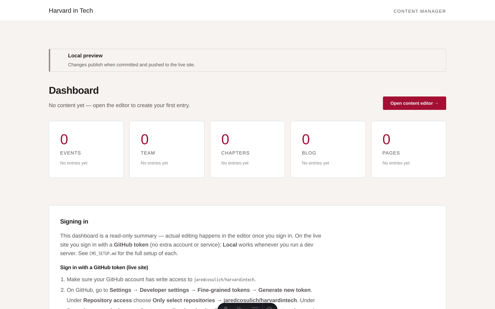
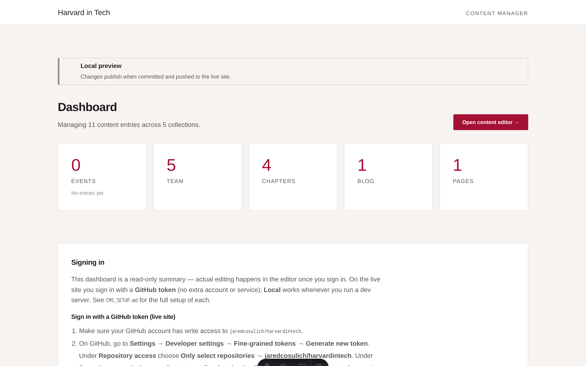
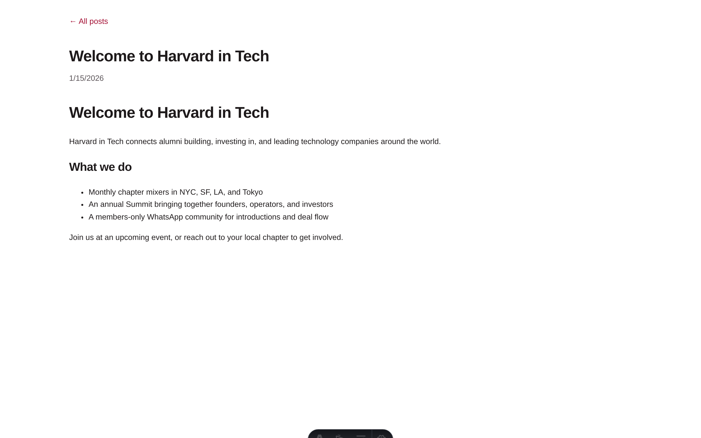
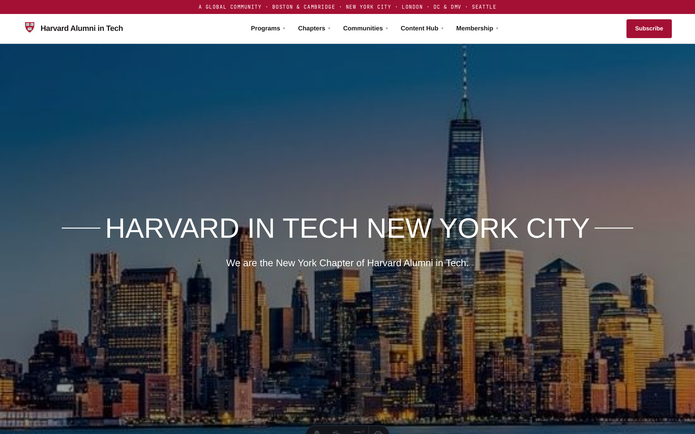
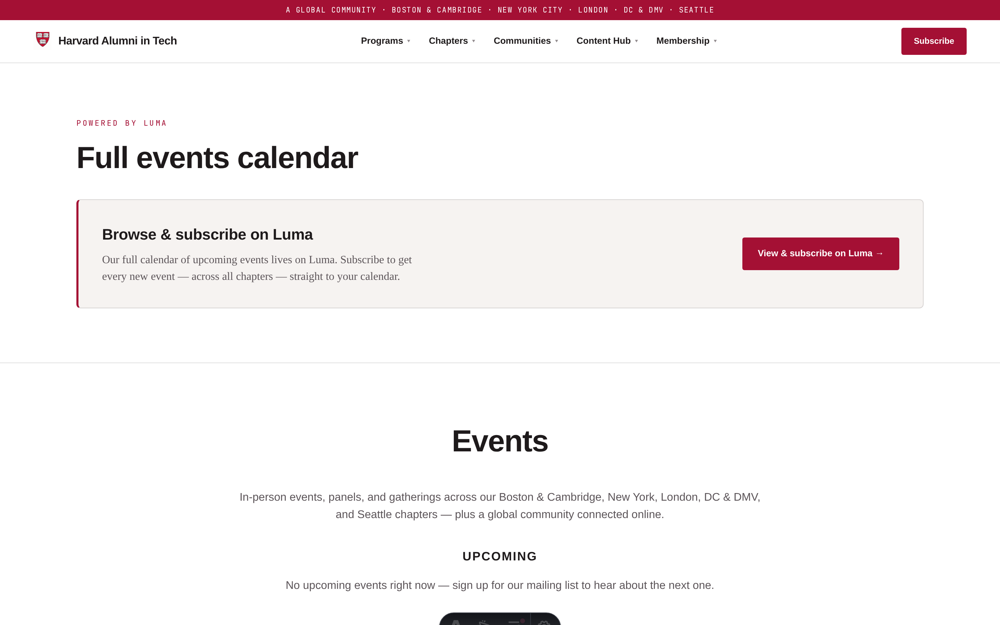
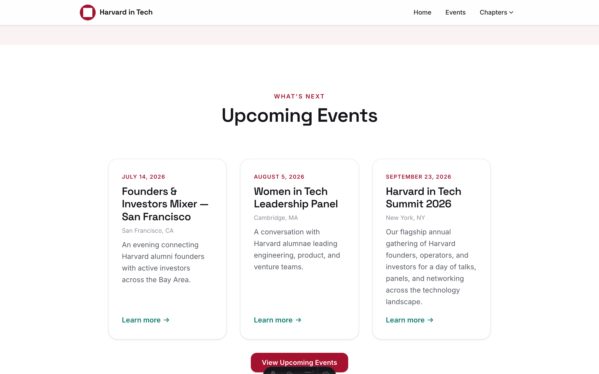

# Harvard in Tech

A modern, statically-exported [Astro](https://astro.build) rebuild of the
[Harvard in Tech](https://www.harvardintech.com/) website — a faithful
reproduction of the original (built on a no-code tool) using modern technology,
hostable for free on GitHub Pages.

Page content lives in typed
[content collections](https://docs.astro.build/en/guides/content-collections/)
(markdown under `src/content/`) and editable JSON singletons (`src/data/`), not a
runtime database — so there is no server to run. A built-in **CRM** edits those
same files: a dashboard at **`/admin`** (live content counts) fronting the
[Sveltia CMS](https://github.com/sveltia/sveltia-cms) editor at
**`/admin/editor/`**. See [`CMS_SETUP.md`](./CMS_SETUP.md) for the two sign-in
paths: **Local** and **Token** (paste a fine-grained GitHub PAT).

## Setup

```bash
npm run setup      # install dependencies (+ Playwright browser for captures)
npm run dev        # http://127.0.0.1:4321
npm run build      # type-check + static build into dist/
npm run test       # component unit tests (vitest + jsdom)
```

A fresh clone works with: `git clone` → `npm run setup` → `npm run dev`.

## Project shape

```
src/
  pages/index.astro          # the landing page — composes the section components
  pages/admin/index.astro     # the CRM dashboard (/admin) — content counts + editor link
  components/landing/         # one component per landing section (Hero, Board, …)
  components/admin/           # CRM dashboard sections (count cards, summary, sign-in)
  layouts/BaseLayout.astro    # site shell: data-driven header/nav + footer + SEO
  layouts/AdminLayout.astro   # CRM shell: header chrome + noindex + content column
  content/                    # typed content collections (events, team, chapters, pages, blog)
  data/                       # editable settings.json + nav.json singletons
  lib/                        # site.ts, mailto.ts, adminDashboard.ts (count helpers)
  styles/tokens.css           # design tokens (brand blue, Roboto, spacing)
public/admin/editor/          # Sveltia CMS app (index.html + config.yml) served at /admin/editor/
public/images/                # hero/section backgrounds, board graphic, event gallery
```

## Deploy to GitHub Pages

1. In `astro.config.mjs`, set `site` to your Pages URL and `base` to your repo
   path (drop `base` for a `<user>.github.io` root site).
2. Push to `main` — `.github/workflows/deploy.yml` enables Pages automatically
   (Source: **GitHub Actions**), then builds and deploys. No manual Settings →
   Pages toggle in the common case; see [`DEPLOY_SETUP.md`](./DEPLOY_SETUP.md)
   for the fallback if the first deploy 404s.

<!-- codeyam:run-and-edit:start -->
## Develop this project with codeyam-editor

This project is built with [codeyam-editor](https://codeyam.com) — code and runnable data scenarios are authored side by side against a live preview.

```bash
# Launch the editor (split-screen terminal + live preview)
codeyam-editor editor

# Run the app
npm run dev

# Run the tests
npx vitest run
```
<!-- codeyam:run-and-edit:end -->

<!-- codeyam:scenario-gallery:start -->
## Scenario gallery

States captured as runnable scenarios with codeyam-editor:

### Admin Dashboard - Empty



### Admin Dashboard - Populated



### Blog Post - Welcome



### Chapter Route - New York City



### Events Route - Upcoming and Past



### Harvard in Tech - Board of Directors


### Harvard in Tech - Landing Page


### Harvard in Tech - No Upcoming Events


<!-- codeyam:scenario-gallery:end -->
