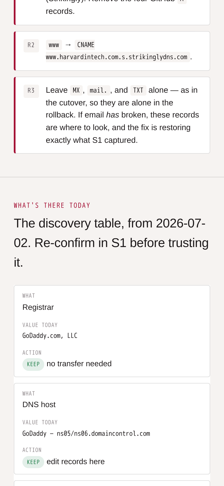
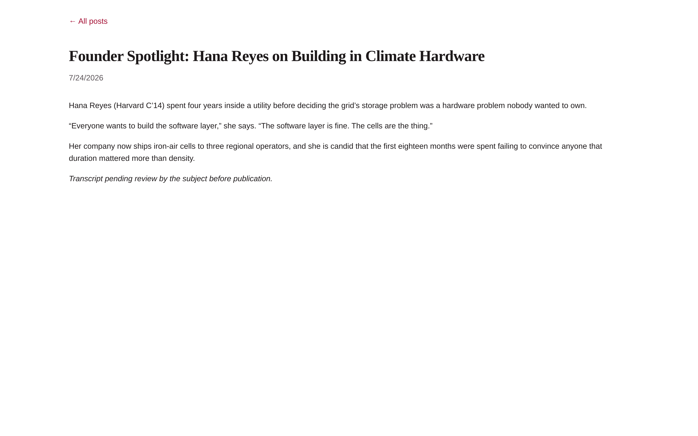
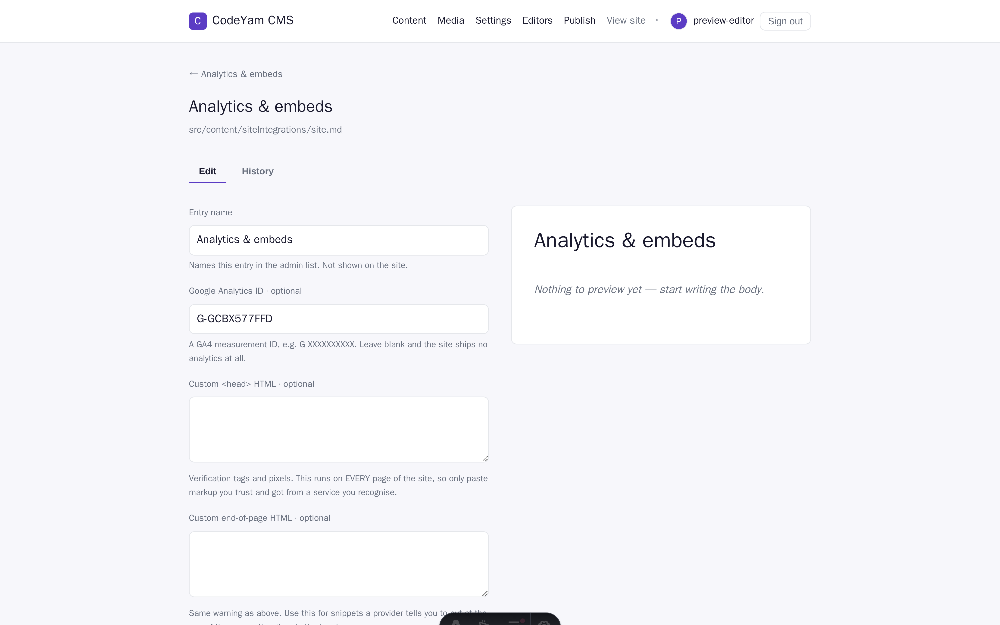
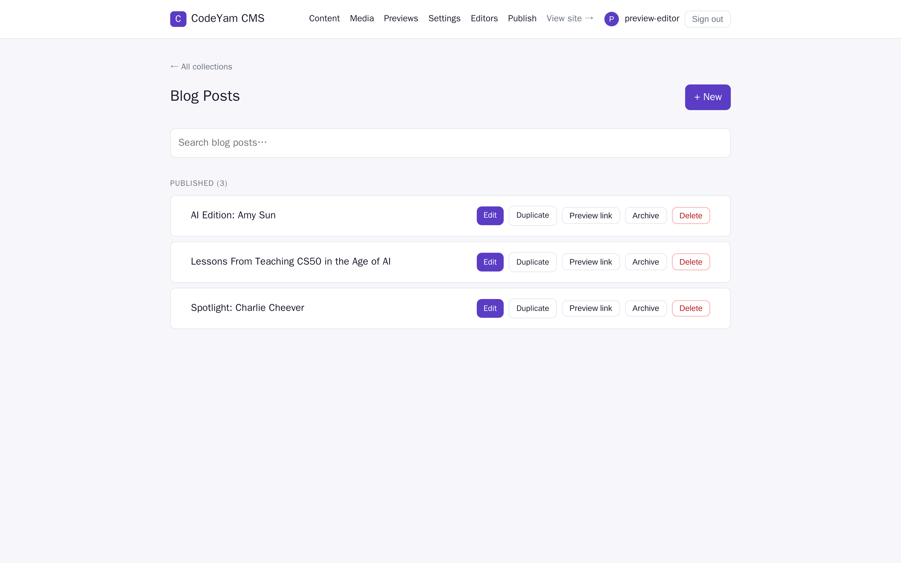
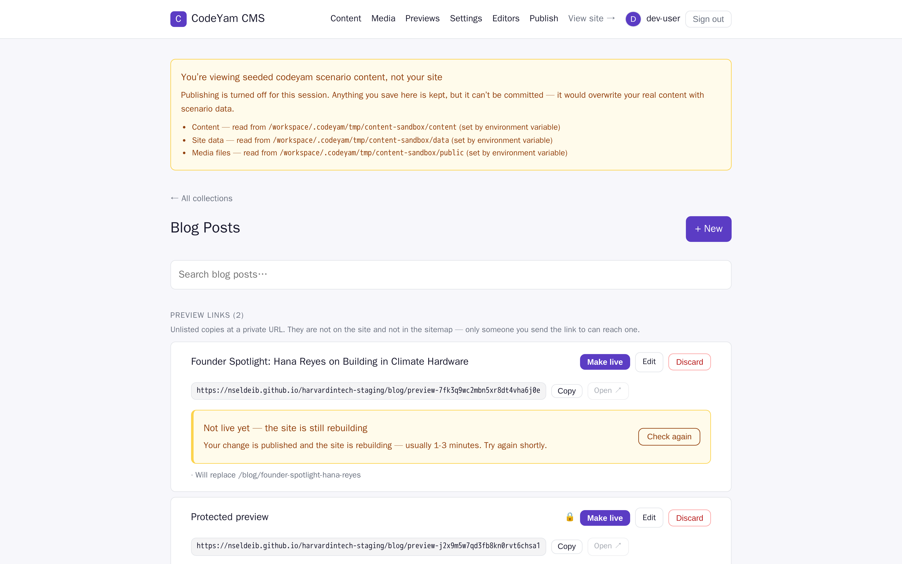

# Harvard in Tech

A modern, statically-exported [Astro](https://astro.build) rebuild of the
[Harvard in Tech](https://www.harvardintech.com/) website — a faithful
reproduction of the original (built on a no-code tool) using modern technology,
hostable for free on GitHub Pages.

Page content lives in typed
[content collections](https://docs.astro.build/en/guides/content-collections/)
(markdown under `src/content/`) and editable JSON singletons (`src/data/`), not a
runtime database — so there is no server to run.
[**@codeyam/cms**](https://www.npmjs.com/package/@codeyam/cms) edits those same
files: an Astro integration that owns **`/admin`** — content dashboard, entry
editor, media library, site settings, and a publish flow that batches edits into
one GitHub commit. See [`CMS_SETUP.md`](./CMS_SETUP.md) for the two sign-in
paths: **Local** and **Token** (paste a fine-grained GitHub PAT).

## Setup

```bash
npm run setup      # install dependencies (+ Playwright browser for captures)
npm run dev        # http://127.0.0.1:4321
npm run build      # type-check + static build into dist/
npm run test       # component unit tests (vitest + jsdom)
```

A fresh clone works with: `git clone` → `npm run setup` → `npm run dev`.

### Patched dependency

`@codeyam/cms` is pinned to an exact version and carries a local patch in
`patches/`, applied automatically by `patch-package` on `postinstall`. The patch
adds two admin controls the package does not ship: **reorder arrows** on any
collection declaring a numeric `order`, and **Duplicate** on every entry row,
which opens the ordinary create form prefilled from the source entry. Without
them, rearranging the donate page means opening each section and typing a number
while holding the other five in your head, and starting a section from an
existing one means retyping it. The version is pinned exactly because the patch
is version-stamped: a floating range would install a version the patch cannot
apply to and break `npm install` for everyone. **Duplicate landed upstream in
0.13.0**, so that half of the patch was deleted — the feature moved into the
dependency rather than out of the product. The reorder arrows are still ours.
Both are covered from this repo — `src/lib/cmsOrderControls.test.ts` for the
arrows, `src/lib/duplicateEntry.test.ts` now holding the released Duplicate to
its contract — so if a future release drops or reworks either, CI says so
instead of an editor finding the buttons gone. The arrows belong upstream too;
drop the rest of the patch once they land there. See `CMS_SETUP.md` for the
upgrade procedure.

## Project shape

```
src/
  pages/index.astro          # the landing page — composes the section components
  pages/volunteer.astro       # /volunteer — the volunteer pitch + open-projects grid
  pages/volunteer/projects/[slug].astro
                              # /volunteer/projects/<slug> — one page per project,
                              #   where a project's full markdown description renders
  pages/donate.astro          # /donate — the Momentum Fund campaign page
  pages/events.astro          # /events — Luma calendar embed + upcoming/past listing
  components/landing/         # one component per landing section (Hero, Board, …)
  components/volunteer/       # /volunteer sections (hero, benefits, project cards)
  components/donate/          # /donate campaign sections (hero, stats, gift pillars,
                              #   quotes, donor recognition wall)
  layouts/BaseLayout.astro    # site shell: data-driven header/nav + footer + SEO
  content/                    # typed content collections (events, team, chapters,
                              #   communities, pages, blog, projects, sponsors,
                              #   testimonials, donors, momentumSections, and the
                              #   page copy an editor owns: volunteerPage,
                              #   sponsorPage, sponsorLevels, siteIntegrations,
                              #   pageCopy)
  data/                       # settings.json + nav.json singletons, cms.json +
                              #   collections.json (CMS config). volunteerPage,
                              #   sponsorPage and donatePage still live here as the
                              #   FALLBACK behind their collections — the CMS has no
                              #   notion of a required singleton, so a deleted entry
                              #   degrades to this committed copy rather than a blank page
  lib/                        # site.ts, mailto.ts, drafts.ts (draft filtering),
                              #   personalize.ts (?name= hero personalization), giving.ts
  styles/tokens.css           # design tokens (brand blue, Roboto, spacing)
public/images/                # hero/section backgrounds, board graphic, event gallery
                              # (/admin is injected by @codeyam/cms — no admin code in this repo)
```

## Deploy to GitHub Pages

1. In `astro.config.mjs`, set `site` to your Pages URL and `base` to your repo
   path (drop `base` for a `<user>.github.io` root site).
2. Push to `main` — `.github/workflows/deploy.yml` enables Pages automatically
   (Source: **GitHub Actions**), then builds and deploys. No manual Settings →
   Pages toggle in the common case; see [`DEPLOY_SETUP.md`](./DEPLOY_SETUP.md)
   for the fallback if the first deploy 404s.

<!-- codeyam:run-and-edit:start -->
## Develop this project with codeyam-editor

This project is built with [codeyam-editor](https://codeyam.com) — code and runnable data scenarios are authored side by side against a live preview.

```bash
# Clone the repo
git clone https://github.com/nseldeib/harvardintech && cd harvardintech

# Install codeyam-editor
npm install -g @codeyam-editor/codeyam-editor@latest

# Launch the editor (split-screen terminal + live preview)
codeyam-editor start
```
<!-- codeyam:run-and-edit:end -->

<!-- codeyam:scenario-gallery:start -->
## Scenario gallery

States captured as runnable scenarios with codeyam-editor:

### Blog Post - Welcome


### Cutover Runbook - The Records On A Phone



### Blog Preview Link - Shared Draft



### CMS Analytics And Embeds



### CMS Blog - Duplicate Is Not Momentum-Fund-Only



### CMS Blog List - A Preview Link And A Locked One



### CMS Chapter Editor - Marked As Draft


### CMS Dashboard - Empty


<!-- codeyam:scenario-gallery:end -->
